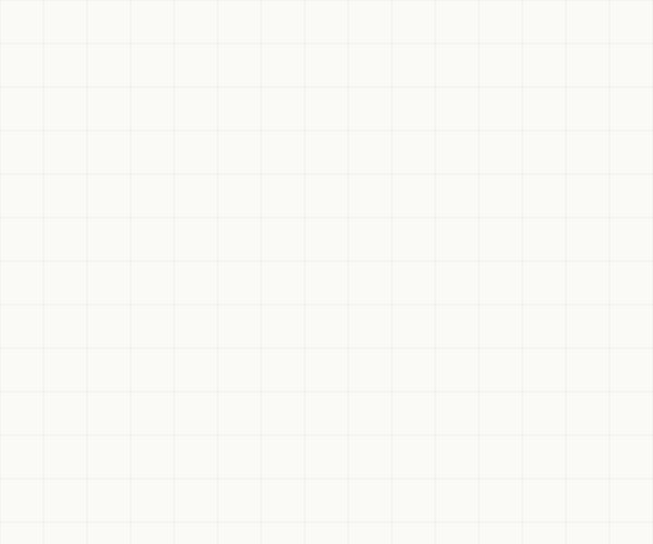

<div align="center">
<h2 align="center">
  
  &nbsp;&nbsp;Solarch&nbsp;&nbsp;
</h2>
  <p>Bridging diagrams and code via a strict rules engine to stop AI errors.</p>
<br/>

*Your entire workspace, on one canvas. | AI that ships. No more hallucinations.*

<br />

[](https://app.solarch.dev)
[](https://solarch.dev)
[](./LICENSE)
[](https://github.com/solarch-dev/solarch/stargazers)
[](https://github.com/solarch-dev/solarch/commits/main)
[](https://app.solarch.dev)

<br />

### ▶ &nbsp; Try it live — no install — at **[app.solarch.dev](https://app.solarch.dev)** &nbsp; · &nbsp; Learn more at **[solarch.dev](https://solarch.dev)**

<br />


<br />

[**Why Solarch?**](#-why-solarch) &nbsp; • &nbsp; [**Gallery**](#-gallery) &nbsp; • &nbsp; [**Features**](#-features) &nbsp; • &nbsp; [**Philosophy**](#-the-philosophy) &nbsp; • &nbsp; [**Self-Hosting**](#-self-hosting) &nbsp; • &nbsp; [**Get Involved**](#-get-involved)

</div>

<br />

---

## ✦ Why Solarch?

Most AI tools generate code and hope the architecture catches up. **Solarch flips that.**

It generates **architecture first** — grounded in a library of canonical patterns, validated by a strict Rules Engine, refined through a self-correcting loop. The AI proposes; the rules verify; only correct graphs ever land on the canvas.

*   **One canvas for the whole system:** 21 node families — controllers, services, repositories, tables, DTOs, queues — and the 16 semantic edges between them.
*   **AI Architect grounded in GraphRAG:** an agentic LLM pipeline pulls from a vector-indexed pattern library. It never starts from a blank context, never invents an API surface.
*   **Rules Engine that refuses to lie:** 32 whitelist rules, 7 anti-patterns, 3 conditional checks. Frontends can't talk to tables. Controllers can't reach repositories. Period.
*   **Self-correcting loop:** Rules rejection feeds back into the agent; the AI revises and tries again until the graph is clean — or never commits.
*   **Live Instruct Mode:** Switch modes and chat with your design. Every answer cites the exact nodes; chips focus the canvas in real time.
*   **Single-home + reference tabs:** Each node lives in one tab. Other tabs *import* it as a reference, not a copy. One source of truth, multiple views.
*   **Type-safe from DB to button:** Zod schemas at the backend, OpenAPI in the middle, `openapi-fetch` on the frontend. The API contract is a compile-time check.

---

## ✦ Gallery

<table width="100%">
  <tr>
    <td width="50%" valign="top">
      <b>1. Start with a prompt</b><br/>
      Type what you want to build. The AI Architect kicks in: pulls canonical patterns, plans the graph, and applies it through the Rules Engine.<br/><br/>
      
    </td>
    <td width="50%" valign="top">
      <b>2. Sketch → architecture <i>(preview)</i></b><br/>
      Freeform sketch becomes a structured graph on <b>Refine</b>. Native sketch surface on the roadmap; the AI-driven refine path runs today.<br/><br/>
      
    </td>
  </tr>
  <tr>
    <td width="50%" valign="top">
      <b>3. Watch it build itself</b><br/>
      Nodes pop in with zen animations, edges flow with the right semantics — every relationship rule-validated before it commits.<br/><br/>
      
    </td>
    <td width="50%" valign="top">
      <b>4. Pattern library <i>(preview)</i></b><br/>
      A standalone constructor library is on the roadmap. The same canonical patterns already power GraphRAG behind the scenes today.<br/><br/>
      
    </td>
  </tr>
  <tr>
    <td width="50%" valign="top">
      <b>5. Connect anything — legally</b><br/>
      Hover a port, drag, snap. The Rules Engine rejects illegal connections instantly. Semantic edges carry meaning, not generic arrows.<br/><br/>
      
    </td>
    <td width="50%" valign="top">
      <b>6. Every node, purpose-built editor</b><br/>
      Double-click any node. Column grids for tables, method tables for services, endpoint rows for controllers — no generic JSON forms.<br/><br/>
      
    </td>
  </tr>
</table>

<div align="center">
  <b>Ask your architecture anything</b><br/>
  Switch to Instruct mode and chat with your design. Every citation is a live chip that focuses the canvas with a soft halo.<br/><br/>
  
</div>

---

## ✦ Features

<table>
  <tr>
    <td width="50%" valign="top">
      <b>AI &amp; Rules</b>
      <ul>
        <li><b>AI Architect:</b> agentic LLM loop with atomic tool calling</li>
        <li><b>Rules Engine:</b> 32 whitelist · 7 blacklist (ERR_001..007) · 3 conditional</li>
        <li><b>GraphRAG:</b> vector search over a canonical pattern library</li>
        <li><b>Self-correction loop:</b> rejection feeds back into agent state, AI revises</li>
        <li><b>Vector-native Neo4j:</b> embeddings + graph in one DB, no extra Pinecone</li>
        <li><b>Local embeddings:</b> compact multilingual sentence-transformer, on-box, 384-d</li>
        <li><b>21 node families:</b> Table, DTO, Model, Service, Worker, Controller, Repository, Cache, Middleware, and more</li>
        <li><b>16 semantic edges:</b> <code>CALLS</code>, <code>QUERIES</code>, <code>WRITES</code>, <code>PUBLISHES</code>, <code>SUBSCRIBES</code>, <code>THROWS</code>...</li>
      </ul>
    </td>
    <td width="50%" valign="top">
      <b>Workspace &amp; UI</b>
      <ul>
        <li><b>Custom Canvas 2D:</b> 60fps, dual-canvas, viewport culling, devicePixelRatio</li>
        <li><b>AI Omni-Bar:</b> Agent (build) + Instruct (Q&amp;A) modes, SSE streaming</li>
        <li><b>Live node chips:</b> citations focus the canvas with a soft halo</li>
        <li><b>Purpose-built inspectors:</b> per-type editors (4 today, the rest on roadmap)</li>
        <li><b>Multi-tab workspace:</b> single-home model + cross-tab references, not copies</li>
        <li><b>Edge bundling &amp; routing:</b> obstacle-aware bezier and elbow paths</li>
        <li><b>Type-safe API client:</b> Zod → OpenAPI → <code>openapi-fetch</code> + <code>openapi-typescript</code></li>
        <li><b>Light Blueprint design:</b> warm paper, semantic family colors, hairline grid, Satoshi + JetBrains Mono</li>
      </ul>
    </td>
  </tr>
</table>

---

## ✦ The Philosophy

> **Solarch doesn't fight AI hallucination — it makes hallucination structurally impossible.**
>
> The industry has spent two years asking LLMs to write code. The result: confident hallucinations, ghost APIs, codebases that compile but lie. Hallucination isn't a tuning problem — it's a category error.
>
> Architecture is the level where structure is **provable**. A controller calls a service. A service queries a repository. A repository writes a table. These relationships are either present or not. They can't be hallucinated.

Solarch stacks three layers that, together, leave no room for an AI to invent something that doesn't exist:

1. **GraphRAG.** The agent starts every request by retrieving canonical patterns from a vector-indexed library. No blank context, no improvisation from zero.
2. **Rules Engine.** Every mutation passes a deterministic gate — 32 whitelist rules, 7 anti-patterns, 3 conditional checks. Illegal edges never land. The schema can't be coerced.
3. **Self-correction loop.** When the Rules Engine rejects a draft, the violation message feeds back into the agent state. The AI revises until the graph is clean, or the request terminates without a commit.

The output isn't *trustworthy* code. It's *provably correct* structure.

**Provable structure. Targeted intelligence. Zero hallucinated APIs.**

---

## ✦ Self-Hosting

The fastest way to use Solarch is the hosted app — **[app.solarch.dev](https://app.solarch.dev)** — no setup, always up to date.

To run the whole stack yourself — a vector-native Neo4j, the NestJS server, and the canvas web app behind a single-origin proxy — one command:

```bash
git clone https://github.com/solarch-dev/solarch.git
cd solarch
cp .env.example .env          # set NEO4J_PASSWORD, Clerk keys, and an LLM provider key
docker compose up --build
# → http://localhost:3000
```

On first boot the server initializes the graph database (schema, the GraphRAG vector index, and the canonical pattern seed) — idempotent, so restarts are safe. Only Clerk and one OpenAI-compatible LLM key are required; everything else degrades gracefully. Full guide: **[docs/self-hosting.md](./docs/self-hosting.md)**.

### Repository layout

```
apps/
  web/      Vite + React 19 — the canvas editor (custom Canvas 2D renderer)
  server/   NestJS 11 + Neo4j — graph model, Rules Engine, AI, codegen
deploy/     Caddyfile (single-origin reverse proxy)
docs/       self-hosting + architecture
```

pnpm workspaces + Turborepo. See **[docs/architecture.md](./docs/architecture.md)** for how it fits together, and **[CONTRIBUTING.md](./CONTRIBUTING.md)** for local development without Docker.

---

## ✦ Get Involved

We welcome feedback, discussions, and contributions.

- 💬 [**GitHub Discussions**](https://github.com/solarch-dev/solarch/discussions) — Feature requests, design feedback, questions.
- 🐛 [**Issues**](https://github.com/solarch-dev/solarch/issues) — Bug reports, regressions.
- 🛠️ [**Contributing Guide**](./CONTRIBUTING.md) — Local setup, conventions, commit style.

<br/>

## ✦ License

[PolyForm Noncommercial License 1.0.0](./LICENSE) — © 2026 Ugur Akdogan.

**Free** for personal use, research, education, and non-profit organizations. Source is open: fork, learn, modify, share — go for it. <br/>
**Commercial use requires a separate license** — reach out at [info@solidea.tech](mailto:info@solidea.tech).

<br/>
<div align="center">
  <b>See. Understand. Plan.</b><br/>
  In one shot.<br/><br/>
  <a href="https://app.solarch.dev"></a><br/>
  <b><a href="https://app.solarch.dev">Solarch.</a></b>
</div>
