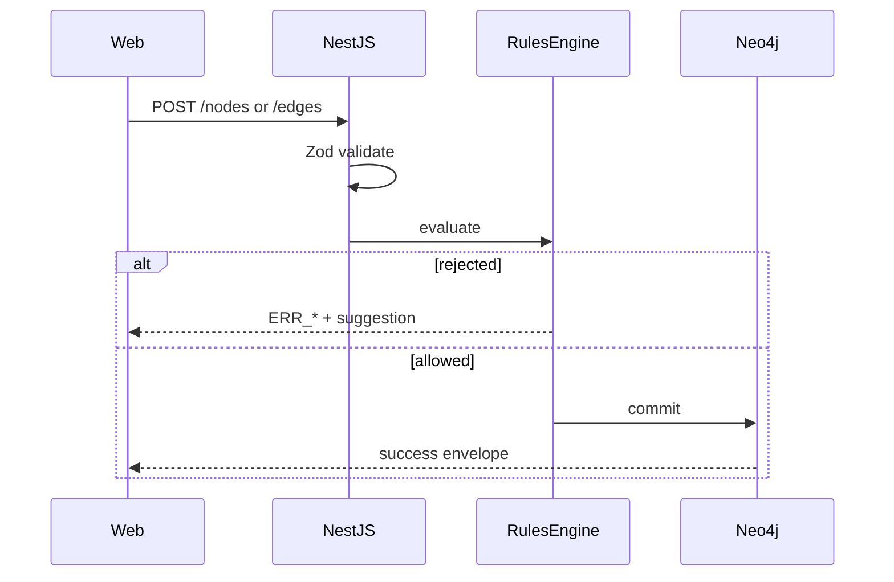

# Architecture

Solarch is a monorepo with two deployable apps that share one thesis: **architecture is
generated first, validated by a strict Rules Engine, and only correct graphs ever land**.

```
solarch/
  apps/
    web/      Vite + React 19 — canvas editor (custom Canvas 2D renderer)
    server/   NestJS 11 + Neo4j — graph model, Rules Engine, AI, codegen
  docs/       user documentation
  deploy/     Caddyfile (single-origin reverse proxy reference)
```

Tooling: **pnpm workspaces** + **Turborepo**. One lockfile; `pnpm build` / `pnpm dev` fan out to
both apps.

Published tooling (**CLI**, **MCP**, VS Code extension) lives in
[`solarch-tools`](https://github.com/solarch-dev/solarch-tools). The server invokes
`@solarch/cli` for surgical fill in Docker/production images.

## Server (`apps/server`)

NestJS API over a Neo4j graph. The graph **is** the source of truth.

| Module area | Role |
|-------------|------|
| `rules/` | Deterministic gate — whitelist, blacklist, conditional checks |
| `nodes/`, `edges/` | CRUD + Zod schemas (21 node kinds, 16 edge kinds) |
| `graph/` | Atomic batch apply (AI, UI, CLI) with revision conflicts |
| `tabs/` | Multi-tab views + cross-tab node references |
| `ai/` | Agentic LLM loop with tool calls; Instruct chat |
| `patterns/`, `embeddings/` | GraphRAG — local embeddings + vector search |
| `codegen/` | IR + NestJS emitters; CLI subprocess for fill |
| `auth/` | `LocalAuthGuard` + API keys (`slk_*`) |

Deep dives:

- [Canvas & Rules Engine](canvas-and-rules.md)
- [AI Architect](ai-architect.md)
- [Codegen](codegen.md)
- [CLI & API keys](cli-and-api-keys.md)

The server binds `127.0.0.1` by default (`HOST` in env). In Docker Compose the server uses
`HOST=0.0.0.0` inside the container network; the host port is still gated by `BIND_ADDRESS`.

## Web (`apps/web`)

Vite + React 19 SPA with a **custom Canvas 2D** renderer (dual canvas, viewport culling).

- **State** — Zustand + TanStack Query; typed `openapi-fetch` client.
- **Surfaces** — Canvas, Code, API, Docs ([Getting started](getting-started.md)).
- **Contract** — OpenAPI-generated types; backend schema drift breaks the web build.

Dev: Vite proxies `/api` to `:4000`. Production: Caddy same-origin proxy ([Deployment](deployment.md)).

## End-to-end request flow



**AI path:** retrieve patterns → LLM tool calls → same Rules path per mutation → stream progress.

**Codegen path:** read graph → IR → emit files → optional CLI fill stream.

## Auth model (OSS)

No third-party auth or billing. `LocalAuthGuard` assigns `LOCAL_USER_ID` to browser traffic; CLI presents
`slk_*` keys. See [CLI & API keys](cli-and-api-keys.md).

## See also

- [Development](development.md) — run locally.
- [Self-hosting](self-hosting.md) — env and security.
- [Docs index](README.md)
