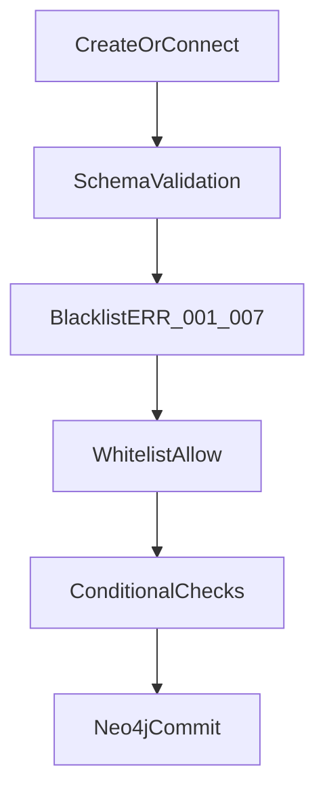

# Canvas & Rules Engine

Solarch stores your architecture as a **typed graph**: nodes (components) and edges
(relationships). Every create and connect goes through the **Rules Engine** — a deterministic
gate that enforces layering before Neo4j commits anything.

## Graph model

- **Project** — workspace; owns nodes, edges, and tabs.
- **Tab** — a view into the project. Nodes have a **home tab** (where they live). Other tabs can
  **reference** a node (import/shortcut — one canonical node, not a copy).
- **Node** — one of 21 kinds with kind-specific **properties** (columns on a Table, methods on a
  Service, routes on a Controller, …).
- **Edge** — directed link with one of 16 **kinds** (`CALLS`, `WRITES`, `USES`, …).

The Rules Engine evaluates **logical** connections (tab-independent). References do not bypass
rules.

## Node types (21)

| Family | Types |
|--------|-------|
| **Data** | Table, DTO, Model, Enum, View |
| **Logic** | Service, Worker, EventHandler, Orchestrator |
| **Access** | Controller, APIGateway, MessageQueue |
| **Infrastructure** | Repository, Cache, ExternalService |
| **Client** | FrontendApp, UIComponent |
| **Cross-cutting** | Middleware, Exception, EnvironmentVariable, Module |

Each type has a strict Zod schema. Unknown fields or wrong enums return `ERR_SCHEMA_INVALID`.

The in-app **Docs** surface and command palette list every type with examples and typical edges.

## Edge kinds (16)

| Group | Kinds |
|-------|-------|
| Call / comms | `CALLS`, `REQUESTS`, `PUBLISHES`, `SUBSCRIBES` |
| Data / schema | `USES`, `HAS`, `EXTENDS`, `IMPLEMENTS`, `RETURNS` |
| Database / infra | `QUERIES`, `WRITES`, `CACHES_IN` |
| Architecture | `DEPENDS_ON`, `READS_CONFIG`, `THROWS`, `ROUTES_TO` |

**Default deny:** only whitelisted `source → edge → target` triples are allowed. Anything else
returns `ERR_NOT_WHITELISTED`.

**Direction matters.** Passive types (DTO, Enum, Table, Cache, Exception, …) must be the
**target**, not the source. Example: `Controller USES → DTO` is legal;
`DTO USES → Controller` is not.

## Rules Engine layers

1. **Schema** — node/edge payload matches Zod (`ERR_SCHEMA_INVALID`).
2. **Blacklist** — seven hard anti-patterns (always checked first).
3. **Whitelist** — connection must appear in the allow matrix.
4. **Conditional** — e.g. circular Service dependencies, DTO alignment on Controller calls.

Catalog endpoint: `GET /api/v1/rules` (also surfaced in the API docs panel).

## Blacklist error codes

| Code | Meaning (short) |
|------|-----------------|
| `ERR_001` | Client layer must not reach Table/View directly |
| `ERR_002` | Controller must not QUERIES/WRITES Table — use Service/Repository |
| `ERR_003` | Passive data types cannot initiate edges to active components |
| `ERR_004` | DTO must not reference Model (layer leak) |
| `ERR_005` | Backend must not REQUESTS to client (wrong direction) |
| `ERR_006` | APIGateway must not route to Repository/Table |
| `ERR_007` | EventHandler must not RETURN to Controller/DTO (async fire-and-forget) |

Each rejection includes a **suggestion** string the AI Architect uses to self-correct.

## Conditional codes

| Code | Meaning |
|------|---------|
| `ERR_COND_001` | Circular dependency on Service → CALLS → Service |
| `ERR_COND_002` | Controller call parameter mismatch vs Service RequestDTO |

## Other common errors

| Code | Meaning |
|------|---------|
| `ERR_NOT_WHITELISTED` | Triple not in allow list |
| `ERR_VERSION_CONFLICT` | Optimistic lock on node PATCH (`expectedVersion`) |
| `ERR_GRAPH_REVISION_CONFLICT` | Batch apply with stale `baseRevision` |
| `ERR_PROJECT_NOT_FOUND` / `ERR_NODE_NOT_FOUND` | Missing resource |

## Canvas UI modes

- **Technical** — full graph, all node families, inspector editing.
- **Simple** — reduced view for high-level communication (no codegen impact by itself).

Use **Fit** (`F`), **Auto arrange** (`⌥L`), and the command palette for navigation. Proposals
from the AI appear as ghosts until you approve them (where applicable).

## Concurrency

- **`graphRevision`** — bumps on structural mutations; batch `graph/apply` can require
  `baseRevision` to prevent lost updates.
- **`Node.version`** — per-node optimistic locking on PATCH.

CLI push and multi-client editing rely on these counters — see
[CLI & API keys](cli-and-api-keys.md).

## See also

- [AI Architect](ai-architect.md) — how the agent learns from rule rejections.
- [Codegen](codegen.md) — how the graph becomes NestJS.
- [Architecture](architecture.md) — server-side graph storage and API.
