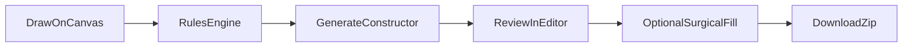

# Codegen

Codegen turns a **validated architecture graph** into a **NestJS project**. Two phases matter:

1. **Constructor** — deterministic, no LLM. Emits modules, controllers, services, entities, DTOs,
   wiring from graph structure.
2. **Surgical AI fill** — optional LLM pass that fills **method bodies** only, guided by graph
   metadata and file regions (via `@solarch/cli` subprocess).

The OSS edition has **no usage caps** on codegen or fill.

## Opening Code mode

From the top bar, switch to **Code**, or use the command palette → **Generate Code**.

Sub-modes:

| Sub-mode | UI | Use |
|----------|-----|-----|
| **Agent** | Fill chat | Surgical AI reads/greps/edits regions; code stays out of the chat stream. |
| **Editor** | Simple file editor | Manual edits on generated files. |

The panel opens over the canvas (same project, preserved state). First open triggers **generate**
once; explicit **regenerate** runs when the diagram drifts (Update/Drift flows).

## Constructor (deterministic scaffold)

The server:

1. Loads the project graph from Neo4j.
2. Builds an internal IR (modules, DI edges, routes, TypeORM-ish entities from Table nodes, …).
3. Runs NestJS **emitters** — file tree with consistent imports and module boundaries.

Output: a downloadable **zip** and an in-panel file tree. Paths and class names come from node
properties (`ServiceName`, `ControllerName`, `TableName`, …), not from LLM invention.

What Constructor does **not** do: invent architecture you did not draw. Missing nodes stay
missing; illegal graphs should already be blocked by the Rules Engine.

## Surgical AI fill

After scaffold exists, **Agent** fill:

- Sends region-scoped context (method signature, related DTO/entity names from the graph).
- Streams tool actions (read file, grep, patch region).
- Runs `@solarch/cli` in an isolated subprocess (bundled in the Docker image; devs may use a
  sibling `solarch-tools` checkout locally).

Fill is rate-limited (`CODEGEN_FILL_THROTTLE_LIMIT` in `.env`) to protect the server from abuse.

Simple View and API/Docs surfaces do **not** trigger fill — they are read/documentation paths.

## Typical workflow

1. Complete the graph (manually or with the AI Architect).
2. **Generate Code** — review module layout and empty method stubs.
3. Optionally run **Surgical fill** for business logic in Services/Repositories.
4. Download zip and drop into your monorepo, or compare with your existing codebase.

## Implementation counters

The CLI can report implementation progress (`implTotal`, `implFilled`, `implAi`) back to the
server for UI badges — structural graph mutations are separate from these counters.

## Requirements

- Valid graph (nodes connected legally).
- For fill: working LLM provider (same as AI Architect).
- Docker image includes CLI bits; local dev may need
  [solarch-tools](https://github.com/solarch-dev/solarch-tools) checkout for bleeding-edge CLI.

## See also

- [Canvas & Rules Engine](canvas-and-rules.md) — graph must be clean before codegen pays off.
- [AI Architect](ai-architect.md) — builds the graph; codegen consumes it.
- [CLI & API keys](cli-and-api-keys.md) — push/pull graph from terminal workflows.
