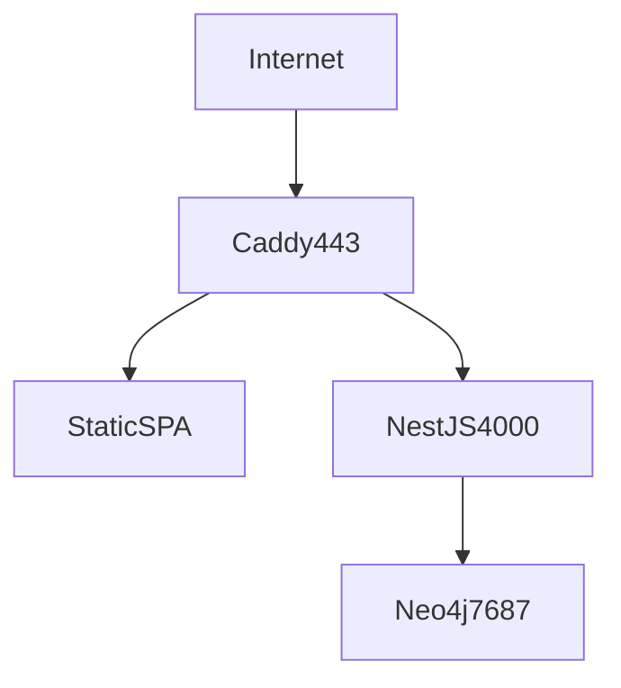

# Deployment

Production layout for a **single-box** Solarch OSS install: one machine, one public hostname,
Neo4j + NestJS + static SPA.

Docker Compose (`docker compose up`) is enough for many teams. This guide covers a **bare-metal
or VPS** pattern with Caddy and systemd — same topology the reference configs use.

## Target topology



- **Single origin** — `https://your.domain` serves both SPA and `/api/v1/*`. Avoids CORS/cookie
  split-brain.
- **Backend bind** — NestJS listens on `127.0.0.1:4000` (default `HOST` in `.env`). Only Caddy
  reaches it.
- **Neo4j** — `127.0.0.1:7687` or Docker internal network; never expose Bolt to the public internet.

## Docker Compose (simplest production)

Use the root [`docker-compose.yml`](../docker-compose.yml) with production `.env`:

```bash
cp .env.example .env
# Set NEO4J_PASSWORD, LLM_*, BIND_ADDRESS, optional Basic Auth
docker compose up -d --build
```

For internet exposure:

```env
BIND_ADDRESS=0.0.0.0
PUBLIC_URL=https://your.domain
SOLARCH_BASIC_AUTH_USER=solarch
SOLARCH_BASIC_AUTH_HASH=<bcrypt from: caddy hash-password --plaintext '…'>
```

Put a reverse proxy with TLS **in front** if you terminate HTTPS elsewhere, or use the Caddyfile
below on the host.

## Caddy (reference)

Copy [`apps/server/deploy/Caddyfile`](../apps/server/deploy/Caddyfile) to `/etc/caddy/Caddyfile`.
Replace `DOMAIN` with your hostname.

- `/api/*` → `reverse_proxy 127.0.0.1:4000`
- Everything else → static files from `/var/www/solarch/dist` (web build output)
- Automatic HTTPS (Let's Encrypt)

Build the web app and publish artifacts:

```bash
pnpm build:web
rsync -a apps/web/dist/ /var/www/solarch/dist/
```

Run the server via systemd (below) or a second Docker service bound to loopback.

## systemd (backend)

Example unit: [`apps/server/deploy/solarch-backend.service`](../apps/server/deploy/solarch-backend.service)

Adjust paths, then:

```bash
sudo cp apps/server/deploy/solarch-backend.service /etc/systemd/system/
sudo systemctl daemon-reload
sudo systemctl enable --now solarch-backend
```

Place `.env` at the configured `EnvironmentFile` path (mode `600`, outside git).

`TimeoutStopSec` allows graceful shutdown (Neo4j driver close).

## Neo4j backups

Scheduled backup units (optional):

- [`solarch-neo4j-backup.service`](../apps/server/deploy/solarch-neo4j-backup.service)
- [`solarch-neo4j-backup.timer`](../apps/server/deploy/solarch-neo4j-backup.timer) — daily 04:00

Configure [`scripts/neo4j-backup.env.example`](../apps/server/scripts/neo4j-backup.env.example)
→ `scripts/neo4j-backup.env` (gitignored).

## Hardening checklist

- [ ] Strong `NEO4J_PASSWORD`; Bolt not publicly reachable
- [ ] `BIND_ADDRESS=0.0.0.0` only with **Basic Auth** (or VPN/Tailscale)
- [ ] Firewall: allow 443 (and 80 for ACME), deny 4000/7687 from WAN
- [ ] Rotate LLM and API keys; limit who can reach Settings
- [ ] Monitor disk — Neo4j volume + embedding model cache

## Updates

```bash
git pull
pnpm install
pnpm build
# redeploy dist + restart solarch-backend (or docker compose up -d --build)
```

Neo4j data persists in the `solarch_neo4j_data` volume — back up before major upgrades.

## See also

- [Self-hosting](self-hosting.md) — env tables, Basic Auth, CLI header combo.
- [Development](development.md) — build commands used in deploy.
- [CLI & API keys](cli-and-api-keys.md) — remote CLI access.
